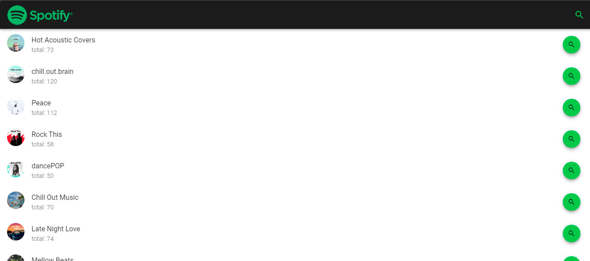
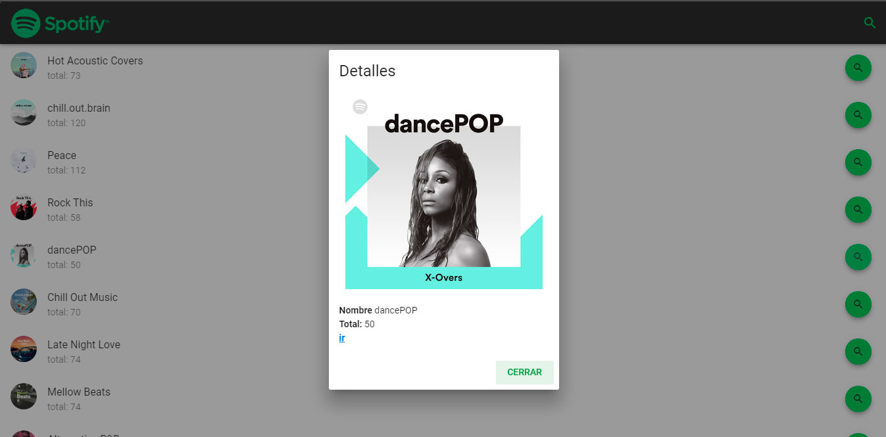

# Spotify Vue.js

> Pantalla Principal

> Pantalla Detalles

> Enlace
[https://fernandoserra.github.io/spotify-vue.js/](https://fernandoserra.github.io/spotify-vue.js/)

> Contacto

[@fernando_serra](https://twitter.com/fernando_serra)

[https://fernandoserra.github.io/grid/](https://fernandoserra.github.io/grid/)